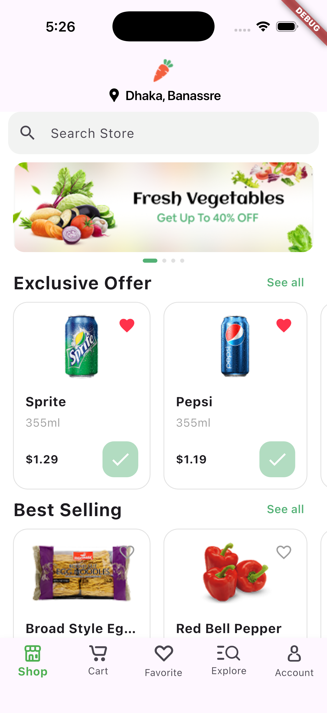
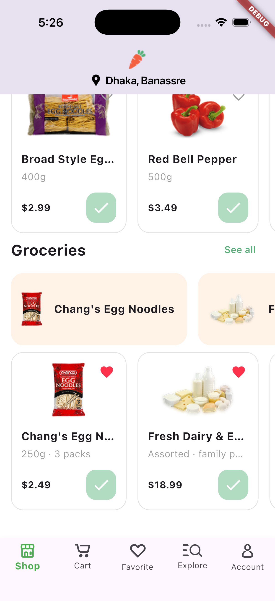
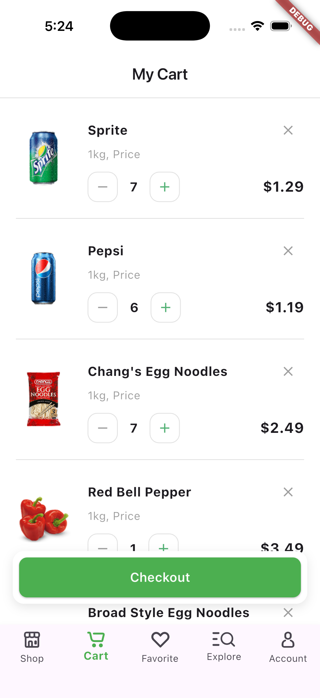
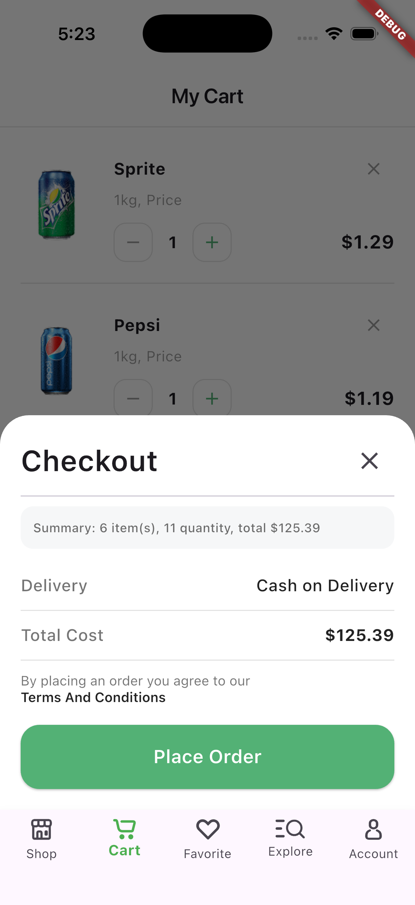
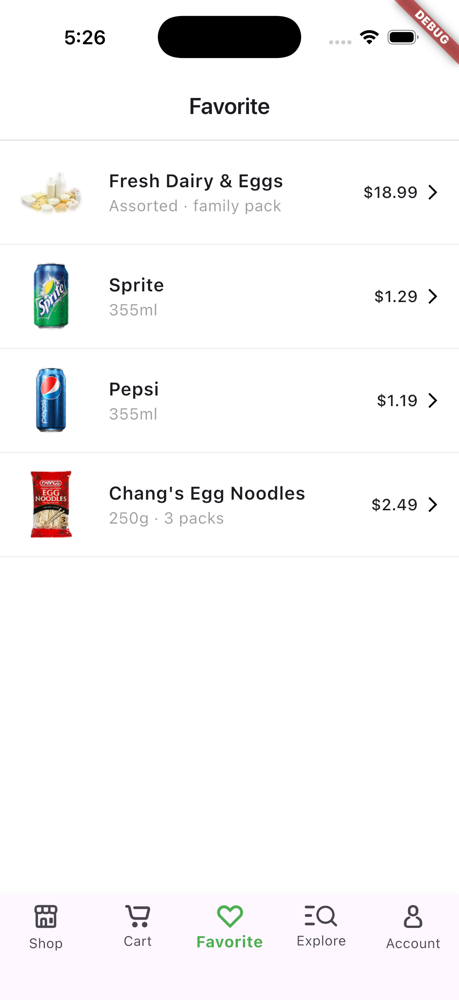
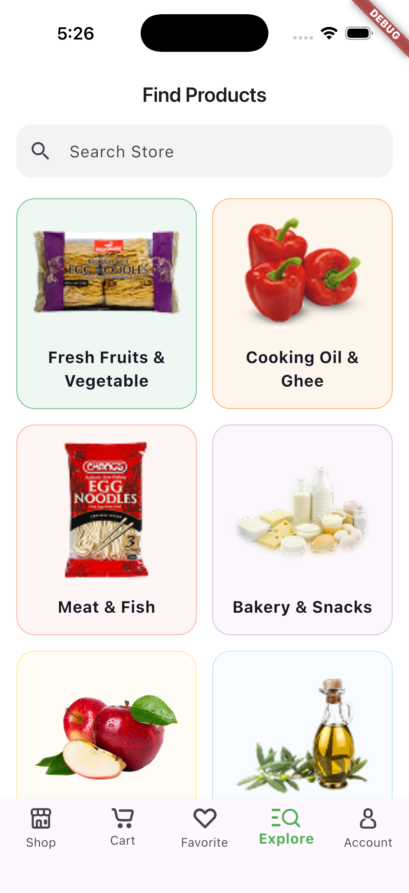
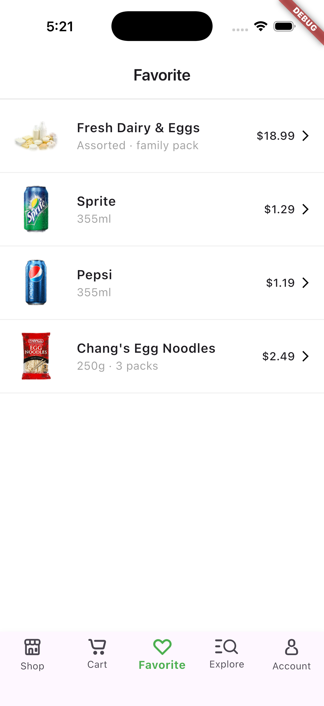

# Nectar Mobile App

Nectar is a Flutter-based grocery shopping mobile application with authentication flow, product catalog browsing, cart management, favorites, explore categories, and account screens.

## Screenshots

<p align="center">
  
  
  
  
</p>
<p align="center">
  
  
  
</p>

## Project Details

### Main Features

- Welcome and sign-in/sign-up flow
- Phone number and verification screen flow
- Location selection screen
- Bottom-tab navigation with `Shop`, `Cart`, `Favorite`, `Explore`, and `Account`
- Product listing sections such as exclusive offers, best-selling, and groceries
- Product details page
- Cart and favorite item management
- Local state persistence for key user data

### App Structure

The project follows a modular Flutter structure:

- `lib/core/`:
  - `routing/` for route path constants and `go_router` configuration
  - `store/` for `ChangeNotifier` providers (auth, cart, favorites, items, etc.)
  - `services/` for reusable services like HTTP API helper
  - `widget/` for shared widgets like bottom tabs
- `lib/modules/`:
  - Screen-wise feature modules (`shop`, `cart`, `favorite`, `explore`, `signin`, `welcome`, `account`, `product_detail`)
- `assets/`:
  - Images, icons, SVGs, banners, and item thumbnails

### Routing and Auth Guard

- Navigation uses `go_router`
- Public and protected routes are defined in `lib/core/routing/router.dart`
- Route redirection checks authentication status from `AuthProvider`
- If user is not authenticated and tries to open protected pages, app redirects to auth login route

### State Management and Local Storage

- State management uses `provider` + `ChangeNotifier`
- Providers are initialized in `lib/main.dart` using `MultiProvider`
- On app start, persisted data is loaded using `SharedPreferences`
- Auth/cart/favorite data are stored locally to preserve app state across relaunch

## Tech Stack and Packages Used

### Core

- **Flutter** (Dart SDK `^3.11.5`)
- **provider** for state management
- **go_router** for declarative routing
- **shared_preferences** for simple local persistence
- **http** for API communication helpers

### UI/Utility

- **flutter_svg** for SVG rendering
- **image_carousel_gallery** for image/banner slider components
- **intl_phone_number_input** for phone number entry/validation UI

### Development Tools

- **flutter_lints** for linting rules
- **flutter_native_splash** for splash screen generation
- **flutter_launcher_icons** for app icon generation

## Setup Instructions

### 1) Prerequisites

Install and verify:

- Flutter SDK (latest stable recommended)
- Dart SDK (comes with Flutter)
- Android Studio (Android SDK + emulator) and/or Xcode (for iOS on macOS)
- Git

Check installation:

```bash
flutter --version
flutter doctor
```

Fix any issues shown by `flutter doctor` before running the project.

### 2) Clone the Repository

```bash
git clone <your-repository-url>
cd nectar-mobile-app
```

### 3) Install Dependencies

```bash
flutter pub get
```

### 4) Run the Application

Run on connected device or emulator/simulator:

```bash
flutter run
```

To view available devices:

```bash
flutter devices
```

### 5) Build Release APK (Android)

```bash
flutter build apk --release
```

### 6) Build iOS (macOS only)

```bash
flutter build ios --release
```

If needed:

```bash
cd ios
pod install
cd ..
```

## Splash and App Icon Regeneration

This project uses configured tooling for splash and launcher icons.

- Splash config: `flutter_native_splash.yaml`
- Launcher icon config: `pubspec.yaml` under `flutter_launcher_icons`

Commands:

```bash
dart run flutter_native_splash:create
dart run flutter_launcher_icons
```

## Useful Commands

```bash
flutter analyze
flutter test
flutter clean
flutter pub get
```

## Notes

- Current data/catalog content is largely seeded locally in providers for UI flow.
- The `ApiService` in `lib/core/services/api_service.dart` is available to integrate remote backend APIs.
- Route protection is currently tied to local auth state (`AuthProvider`).
